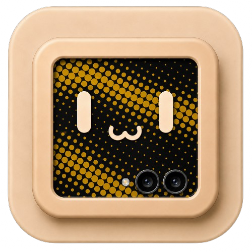

# miniPape

Your folded phone, wearing something you chose.

miniPape makes wallpapers for the cover display of a Samsung Galaxy Z Flip, on
the phone itself. Load a picture or a clip, frame it in a window shaped like the
cover screen, and it cuts the media to fit — exactly what the window showed, no
second crop later.

Built for the Galaxy Z Flip 7 FlexWindow. It runs there and nowhere else.

## What it does

- **Load** — any still or clip on the phone. JPEG, PNG, WEBP, HEIC, AVIF, GIF,
  MP4, MOV, M4V, WEBM.
- **Frame** — drag the media around, pinch to zoom, or work the bars. The media
  cannot be pushed off its own canvas: what covers the window at rest still
  covers it at full travel, on both axes.
- **Trim** — two selectors on a line, for choosing where a clip starts and ends.
- **Loop** — on, and the GIF runs forever. Off, and it stops on its last frame.
- **Chromatic aberration** — red pulled one way, blue the other, rippling down
  the frame. Baked into the file, previewed live at the strength it will have.
- **Save** — cut to 948 × 1048, still to PNG and motion to GIF, filed in
  Pictures/miniPape and handed straight to whichever gallery you like.

## The cut

Stills are cropped and written whole. Motion is decoded frame by frame, trimmed,
quantised to a palette built from the clip itself, and LZW-compressed into a
GIF89a — written here rather than borrowed, and checked by decoding it back with
an independent reader. Looping is the Netscape block; leaving it out is what
makes a GIF rest on its last frame.

Installation is handed to the public Samsung wallpaper flow. Android exposes
system and lock wallpaper destinations but no cover-screen one, so miniPape cuts
the file, keeps it as its own cover preview, and lets the system do the rest.

## Mont

The interface is [Mont](https://github.com/RimorCosmicam) — black, white, and one
accent at a time. No rounded corners, no borders, no pills: a selected thing is
simply the bright one. The typeface is a commercial face from Fontfabric — check
your own licence before reusing the files in `res/font`.

## Building

Everything is built by GitHub Actions. Push to `main` and take the artifact from
the run, or start the workflow by hand.

```
gh run download <run-id> -R RimorCosmicam/miniPape -n miniPape-android-debug
```

The workflow runs the unit tests before it builds, so a green run is one where
the framing limits and the GIF writer both still hold.

## Open source

MIT. Do what you like with it (but let me know, I love cool stuff).
